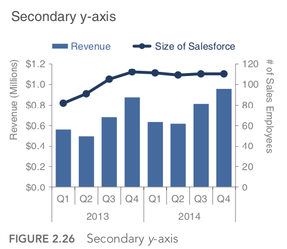

# Chart checklist

List of items to go through before release a chart.

I learn from:

- [Storytelling with Data: A Data Visualization Guide for Business Professionals](https://www.goodreads.com/book/show/26535513-storytelling-with-data)
- [The Visual Display of Quantitative Information](https://www.goodreads.com/book/show/17744.The_Visual_Display_of_Quantitative_Information)

# General

- Keep a high percent of data ink: “the larger the share of a graphic’s ink devoted to data, the better (other relevant matters being equal).”
    - no clutter effect
    - remove chart border
- Axis/labels are de-emphasized. E.g: make it grey
- Never use 3D
- Use business term. E.g:
    - not good: month_key, organization_name
    - good: Month, Organization
- Avoid second axis. Second axis takes some time and reading to understand which data should be read against which axis.
    - E.g:
        - From

            

        - To
            - Don’t show the secondy‐axis.Instead,labelthedatapointsthat belong on this axis directly.

                

            - Pullthegraphsapartverticallyandhaveaseparatey‐axisforeach (both along the left) but leverage the same x‐axis across both.

                

# Table

- Avoid using table
- Try to highlight the information you want to communicate. e.g: make it a heat map
- Draw our audience’s eyes in the direction we want them to focus: row or columns. Approaches:
    - spacing

        

    - similarity

        

# Lines

- Are most commonly used to plot continuous data
- Horizontal x‐axis label must be in consistent intervals. Eg: 1, 2, 3, 4, 5 but not 1, 2, 4, 5
- No data marker (triangle, square, oval,...)

# Bars

- Logical ordering of categories:
    - is there a natural ordering?  leverage that

## Vertical

- Vertical axis starts from zero
- Bar width and spacing: guide the audiences compare height, not width

## Horizontal

Use when:

- category names are long, so read from left to right is easier

# Pie

- Even it is not 3D, it should be replace by horizontal bar chart or accurately interpreting the data
    - From

        

    - To

        
